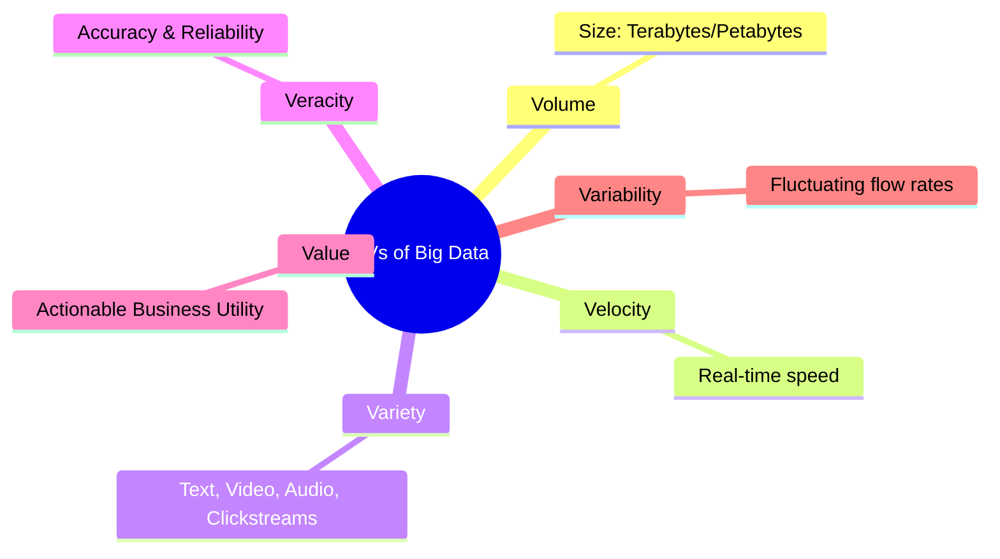
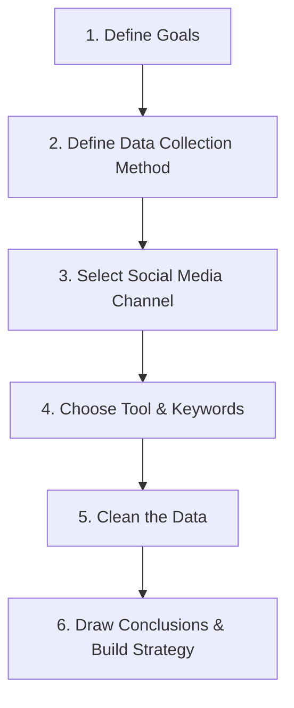

# Block 4 Notes: Emerging Issues

This revision guide covers the core concepts, digital frameworks, and modern technologies from **Units 13, 14, and 15** of MMPM-006. It is designed for quick scanning and high retention on exam day.

---

## Unit 13: Big Data and Marketing Research

### 1. What is Big Data?
Big Data refers to data sets characterized by a wider variety, arriving at faster speeds, and in larger volumes than traditional databases can manage. 

#### The Four Types of Big Data:
1. **Structured Data:** Formatted data that can be easily collected, saved, retrieved, and processed (e.g., SQL tables, transactional records).
2. **Semi-structured Data:** A mix of structured and unstructured elements (e.g., XML/JSON files, emails with metadata).
3. **Quasi-structured Data:** Data with erratic formats that falls between semi-structured and unstructured (e.g., web clickstreams, server logs).
4. **Unstructured Data:** Data lacking any pre-defined structure or hierarchy (e.g., text, video, audio files).

---

### 2. The 6Vs of Big Data
Big Data is characterized by six critical dimensions:

* **Volume:** The sheer size of the datasets (petabytes and exabytes).
* **Variety:** The diversity of data formats (structured transactional data vs. unstructured social media videos).
* **Velocity:** The speed at which new data is generated and processed in real-time.
* **Veracity:** The accuracy, quality, and trustworthiness of the collected data.
* **Value:** The ability to convert raw data into actionable business insights.
* **Variability:** The rate at which the data under investigation changes or fluctuates over time.

---

### 3. The Big Data Insights Process
To gain value from Big Data, organizations execute a multi-stage data processing pipeline:
1. **Data Acquisition:** Capturing data from digital touchpoints (smartphones, IoT, transactional databases).
2. **Extraction and Cleaning:** Reformatting unstructured datasets and repairing missing, erroneous, or corrupted data.
3. **Integration and Aggregation:** Reconciling and combining disparate datasets (e.g., merging credit card transactions with store logs).
4. **Modeling and Analysis:** Using machine learning models to analyze text (tweets), audio (call recordings), video (unboxing clips), or networks (community detection).
5. **Interpretation:** Translating statistical models into visual dashboards, forecasting tables, or decision trees.

---

### 4. Marketing Applications of Big Data
* **Customer Relationship Building:** Analyzing customer journey touchpoints (e.g., flight booking habits) to offer customized tourism/hotel deals.
* **Product Development & Positioning:** Utilizing predictive demand models (like Netflix recommendations or P&G test market analytics) to pre-test product concepts.
* **Dynamic Pricing & Promotions:** Adjusting prices in real-time based on competitor rates and consumer interest (e.g., Amazon altering prices millions of times per day).
* **Price Optimization:** Analyzing purchase histories to manage inventory clearance levels.
* **360-Degree Know Your Customer (KYC):** Building a comprehensive profile of consumer interactions across online and offline touchpoints.

---

### 5. Key Challenges in Big Data Implementation
* **System Design & Cost:** Building customized tech stacks requires major IT infrastructure and skilled database professionals.
* **Storage Space:** Managing massive files (particularly unstructured audio/video) demands extensive cloud/data center capacity.
* **Skill Gaps:** Scarcity of qualified data scientists capable of using advanced analytic tools and interpreting complex models.
* **Data Security & Privacy:** Protecting databases from hackers and adhering to strict regional data protection guidelines.
* **Integration Hurdles:** Standardizing data flowing from ERPs, CRM systems, web logs, and social media sites.

---

## Unit 14: Internet-Based Marketing Research

### 1. Purpose and Applications
Internet-based (online) marketing research adapts traditional survey, panel, and observational methods to the Web.
* **Target Audience Profiling:** Mapping digital consumer demographics (age, spending, habits).
* **Competitor Audits:** Scraping competitor websites for catalogs, pricing changes, and promotional schedules.
* **Usage & Web Analytics:** Tracking website visitor counts, navigation paths, and page durations using **cookies** (small text files that record browser activities).

---

### 2. Advantages vs. Limitations of Online MR
* **Advantages:**
  * **Low Cost:** Drastically cheaper than physical mail, phone surveys, or face-to-face interviewing.
  * **Speed:** Extremely fast data collection and real-time tabulation.
  * **Geographical Reach:** Can contact respondents across borders simultaneously.
  * **Customization:** Automated chatbots can adapt questions based on previous answers.
* **Limitations:**
  * **Internet Penetration Bias:** Excludes populations in remote regions with poor digital infrastructure.
  * **Lack of Sensory Testing:** Consumers cannot touch, smell, or taste physical product samples.
  * **No Non-verbal Feedback:** Researchers cannot observe facial expressions or body language.
  * **Authenticity Risk:** Anonymity leads to fake profiles or dummy responses, skewing data.

---

### 3. The 4 Steps in Online Marketing Research
1. **Define the Target Audience:** Specifying the age, location, and digital habits of the target segment.
2. **Prepare the Research Instrument:** Designing relevant, clear surveys tailored to digital platforms (e.g., Zomato app ratings).
3. **Ensure Active Engagement:** Launching the survey via targeted email, social media, online panels, or website banners to maximize sample sizes.
4. **Summarize and Report:** Converting raw data into executive summaries, spreadsheets, and visual reports.

> [!TIP]
> **Online Techniques:**
> * **Online Surveys:** Using Likert scales or dichotomous questions to capture opinions.
> * **Online Focus Groups:** Can be **Asynchronous/Chat-based** (users log in and comment/upload media over days) or **Synchronous/Real-time** (live video/chat sessions led by a moderator).

---

## Unit 15: Marketing Research and Social Media

### 1. Role and Benefits of Social Media MR
Social media serves as a giant focus group. 
* **Sentiment Analysis:** A text-categorization technology that processes online comments/tweets to classify consumer feelings about a brand as **Positive, Negative, or Neutral**.
* **Word Clouds:** Visual tools displaying the most frequent terms used in association with a brand keyword.

---

### 2. The 6 Steps of the Social Media MR Process

1. **Define Target Goals:** What specific brand, product, or competitor metric are you tracking?
2. **Define Data Collection Method:** Quantitative (likes, shares, comment counts) vs. Qualitative (sentiment tracking, theme association).
3. **Select the Channel:** Choosing social networks that match the target audience's demographics.
4. **Choose the Tool and Keywords:** Setting up listening tools with specific brand keywords and search phrases.
5. **Clean the Data:** Removing spam, bots, off-topic comments, and unrelated terms.
6. **Draw Conclusions:** Visualizing findings on dashboards and converting insights into marketing strategies.

---

### 3. Applied Framework: Social Media MR Design
When designing social media research (e.g., a restaurant chain planning a new **Cloud Kitchen** concept):
* **Goal:** Identify high-potential geographic regions and popular food items.
* **Method:** Set up listening tools using localized keywords (e.g., "food delivery," "biryani Indore," "cloud kitchen reviews").
* **Execution:** Analyze competitor customer comments (identifying customer complaints about slow delivery or cold food) and run sentiment analysis to find underserved locations. Target promotional social media ads directly to those geographic hotspots.
