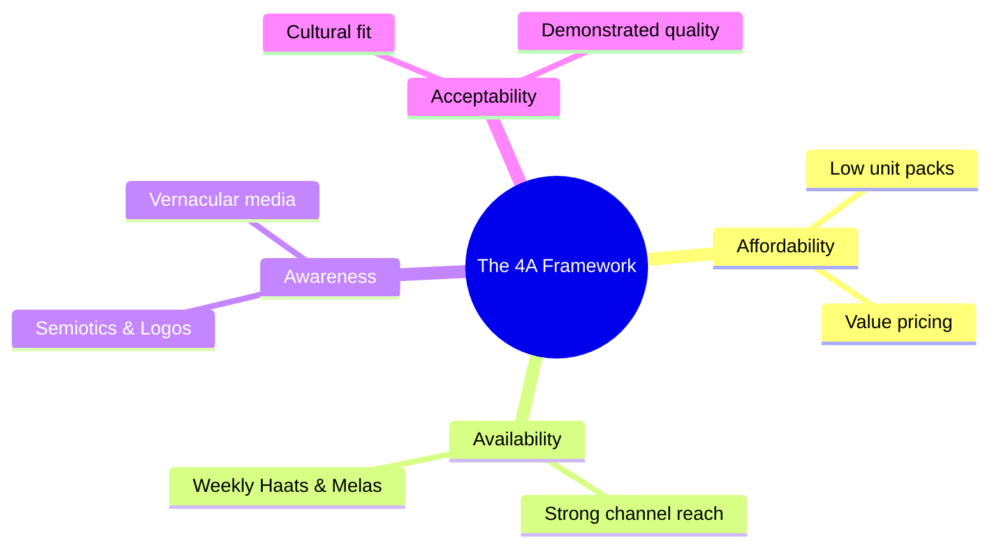

# Block 1 Notes (Hinglish): Rural Markets - An Overview

Yeh revision guide MMPM-008 ke **Units 1, 2, aur 3** ke core concepts, definitions, aur environmental dimensions ko cover karti hai. Isko exam day par jaldi se scan aur revise karne ke liye design kiya gaya hai.

---

## Unit 1: Rural Markets in India

### 1. India mein "Rural" ko Define karna
India mein alag-alag organizations "rural" ko alag tarike se define karte hain. Marketing ke liye in classifications ko samajhna zaroori hai:

* **Census of India (Primary Standard):**
  * Population density **400 people per square kilometer** se kam honi chahiye.
  * Kam se kam **75% male working population** agriculture (kheti) mein engaged ho.
  * Us area mein **koi municipality, corporation, ya cantonment board na ho**.
* **Reserve Bank of India (RBI):** RBI rural ko population size ke basis par classify karta hai (usually up to 10,000 population wale areas rural hote hain, aur 10,000 se 1,00,000 wale semi-urban).
* **NCAER:** NCAER ke according, 5,000 se kam population wale aur low infrastructure development wale locations rural hote hain.

> [!NOTE]
> **Rurban:** Ek modern concept jo un transition zones ko describe karta hai jahan rural lifestyle aur economy urban infrastructure facilities (semi-urban hubs ya rural towns) ke sath merge ho jati hain.

---

### 2. Rural vs. Urban Markets: Main Differences
Ek successful rural marketing strategy sirf urban strategy ka chota version nahi hoti. Marketers ko in key structural differences ko samajhna hoga:

| Parameter | Rural Markets | Urban Markets |
| :--- | :--- | :--- |
| **Main Occupation** | Predominantly agriculture (kheti-badi) aur allied services. | Diverse options (service, manufacturing, white/blue collar jobs). |
| **Income Cycle** | Highly **seasonal** (harvest/fasal katne ke cycles se linked). | **Regular/Monthly** salary cycles. |
| **Brand Loyalty** | **High brand loyalty** (brand switch karna mushkil aur risky lagta hai). | Brand switching normal hai kyunki log promotions aur newness chahte hain. |
| **Reference Influence** | **Opinion leaders** (Sarpanch, teachers, etc.) par zyada depend karte hain. | Media, peer networks, aur online reviews se influence hote hain. |
| **Transaction Basis** | Mostly **cash-dependent**; asset investment (land/gold) zyada hota hai. | Credit cards, digital wallets, aur online banking ka high penetration. |
| **SKU & Sizing** | **Smaller pack sizes (SKUs)** prefer karte hain (sachets, Rs. 5 Coca-Cola). | Bulk sizes, larger packs, aur standard packaging pasand karte hain. |

---

### 3. Rural Consumers tak pahunchne ke Challenges
Rural spaces mein marketing karne ke liye **4A Framework** ko navigate karna padta hai:

* **Affordability:** Low disposable income aur irregular cash flows ki wajah se low unit price points (sachet packaging) zaroori ho jate hain.
* **Availability:** Villages ke bohot bikhre (dispersed) hone ki wajah se intensive retail networks aur creative distribution hubs chahiye.
* **Awareness:** Low literacy rates ki wajah se highly visual communication (semiotics, colors, symbols) aur localized mediums use karne padte hain.
* **Acceptability:** Products local traditions ke according hone chahiye aur unki functional utility (durability, multiple uses) high honi chahiye.

---

## Unit 2 & 3: Understanding the Rural Environment

Rural markets mein enter karte waqt marketers ko paanch main environmental dimensions analyze karne chahiye:

### 1. Political Environment
* **Welfare aur Employment Schemes:** **MGNREGA** (rural households ke adult members ko 100 days ka manual work guarantee karna) jaise programs se disposable income directly badhti hai.
* **Direct Benefit Transfer (DBT):** Aadhaar aur bank accounts (Jan Dhan) ko link karne se middlemen ka corruption khatam ho gaya hai, aur paisa seedhe consumers ke haath mein pahunchta hai.
* **Empowerment:** Panchayati Raj institutions mein women ke liye 50% reservation se unka social status bada hai aur family purchasing dynamics change hui hain.

### 2. Social Environment
* **Family Structure Shifts:** Joint families ab **"individualized joint families"** mein badal rahi hain (ghar ek hi hota hai par kitchen aur spending alag-alag hote hain). Isse household items (soaps, utensils) ki duplicate purchases badh gayi hain.
* **Literacy & Education:** Youth literacy badhne se gharon mein **naye young opinion leaders** ban rahe hain, jo smartphones, TVs aur two-wheelers ki purchase ko drive karte hain.
* **Healthcare Infrastructure:** Log Community Health Centres (CHCs) aur Primary Health Centres (PHCs) par depend karte hain. Health awareness badhne se hygiene products ki demand badh rahi hai.

### 3. Technological Environment
Technology communication, daily tasks, aur transactions mein help karti hai:
* **As a Communicator:** Visuals par dependency high hai. Log Google ke bajaye YouTube prefer karte hain taaki dekh/sun sakein. Brands **Kan Khajura Tesan** (HUL's mobile-radio entertainment in Bihar) jaise tools use karte hain.
* **For Daily Activities:** Farmers smartphones ka use weather alerts, soil analysis, crop prices, aur equipment rent par lene ke liye karte hain.
* **For Transactions:** UPI aur GPay jaise Fintech apps aur micro-lending databases grow kar rahe hain, halanki security aur fraud ka dar ab bhi ek psychological barrier hai.

### 4. Cultural Environment
* **Caste System:** Bohot gehra hai. Aksar local residential areas aur resources (public handpumps) ke access ko decide karta hai.
* **Diet aur Dress:** Regional differences bohot hain. Eastern states mein rice prefer kiya jata hai; western dry states mein wheat/millet (e.g. Rajasthan ka *Dal Baati Churma*). Kapde durable aur colorful hone chahiye.
* **Semiotics in Communication:** Rural consumers brands ko identify karne ke liye signs aur symbols use karte hain (e.g., Eveready "Cat," Gemini Tea "Elephant," Fevicol "Elephant").
* **Celebrity/Reel Influence:** Celebrities credibility late hain. High-authority voices (e.g., Amitabh Bachchan for Pulse Polio ya "TB Harega, Desh Jeetega") myths aur cultural resistance ko todte hain.

### 5. Economic & Physical Environment
* **Economic Realities:** Kheti ke land size chote hone se rural population ab non-farm income (construction, local retail shops, crafts) ki taraf ja rahi hai.
* **Micro-Finance Institutions (MFIs):** Naye MFIs traditional money lenders (*sahukaars*) ki jagah le rahe hain, jo farm inputs aur festivals ke liye easily cash loans dete hain.
* **Physical Dispersal:** 6.5 lakh se zyada villages hain, jo bohot door-door hain. Unhe connect karne ke liye road connectivity (Pradhan Mantri Gram Sadak Yojana - PMGSY) mein invest kiya ja raha hai.
