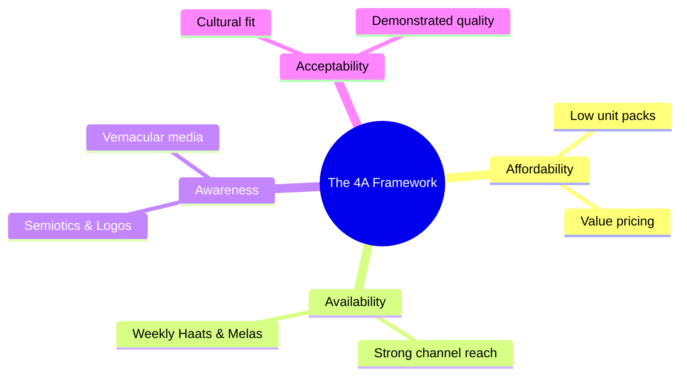

# Block 1 Notes: Rural Markets - An Overview

This revision guide covers the core concepts, definitions, and environmental dimensions from **Units 1, 2, and 3** of MMPM-008. It is designed for quick scanning and high retention on exam day.

---

## Unit 1: Rural Markets in India

### 1. Defining "Rural" in India
In India, "rural" is defined differently by various bodies. For marketing purposes, understanding these classifications is crucial:

* **Census of India (Primary Standard):**
  * Population density is less than **400 people per square kilometer**.
  * At least **75% of the male working population** is engaged in agriculture.
  * The area has **no municipality, corporation, or cantonment board**.
* **Reserve Bank of India (RBI):** Classifies rural based on population size (usually locations with a population up to 10,000 are rural, and semi-urban is 10,000 to 1,00,000).
* **NCAER:** Classifies rural based on locations with a population under 5,000 and low levels of infrastructural development.

> [!NOTE]
> **Rurban:** A modern concept describing the emerging transition zones where rural lifestyles and economy merge with urban infrastructural facilities (semi-urban hubs/rural towns).

---

### 2. Rural vs. Urban Markets: Key Differences
A successful rural marketing strategy is not just a scaled-down version of an urban strategy. Marketers must recognize key structural differences:

| Parameter | Rural Markets | Urban Markets |
| :--- | :--- | :--- |
| **Main Occupation** | Predominantly agriculture & allied services. | Diverse options (service, manufacturing, white/blue collar). |
| **Income Cycle** | Highly **seasonal** (linked to harvest cycles). | **Regular/Monthly** salary cycles. |
| **Brand Loyalty** | **High brand loyalty** (switching brands is rare and risky). | Brand switching is common due to novelty & promotions. |
| **Reference Influence** | Strong reliance on **opinion leaders** (Sarpanch, teachers, etc.). | Influenced by broad media, peer networks, and online reviews. |
| **Transaction Basis** | Mostly **cash-dependent**; high value in assets (land/gold). | High credit/digital wallets/online banking penetration. |
| **SKU & Sizing** | Prefers **smaller pack sizes (SKUs)** (e.g. sachet sizes, Rs. 5 Coca-Cola). | Prefers bulk sizes, larger packs, and standard packaging. |

---

### 3. Challenges in Marketing to Rural Consumers
Marketing in rural spaces involves navigating the **4A Framework**:

* **Affordability:** Low disposable income and irregular cash flows necessitate low unit price points (sachet packaging).
* **Availability:** Highly dispersed villages require intensive retail networks and creative distribution hubs.
* **Awareness:** Low literacy rates require highly visual communication (semiotics, colors, symbols) and localized mediums.
* **Acceptability:** Products must fit local traditions and provide high functional utility (durability, multiple uses).

---

## Unit 2 & 3: Understanding the Rural Environment

When entering rural markets, marketers must analyze five major environmental dimensions:

### 1. Political Environment
* **Welfare and Employment Schemes:** Programs like **MGNREGA** (guaranteeing 100 days of manual work to rural households) have direct impacts on increasing disposable income.
* **Direct Benefit Transfer (DBT):** Connecting Aadhaar and bank accounts (Jan Dhan) directly bypasses corrupt intermediaries, putting money straight into consumer hands.
* **Empowerment:** 50% reservation for women in Panchayati Raj institutions increases women's social stature and changes family purchasing dynamics.

### 2. Social Environment
* **Family Structure Shifts:** Transition from traditional joint families to **"individualized joint families"** (sharing the same house but cooking/spending separately). This leads to an increase in duplicate purchases of household items (soaps, utensils).
* **Literacy & Education:** Rise in youth literacy creates a new class of **young opinion leaders** within rural homes, driving the purchase of smartphones, TVs, and two-wheelers.
* **Healthcare Infrastructure:** Reliance on Community Health Centres (CHCs) and Primary Health Centres (PHCs). Health literacy is rising, driving demands for hygiene products.

### 3. Technological Environment
Technology acts as a communicator, daily assistant, and transactional tool:
* **As a Communicator:** High visual dependency. YouTube is preferred over Google because searchers can watch/listen. Brands use services like **Kan Khajura Tesan** (HUL's mobile-radio entertainment loop in Bihar) for outreach.
* **For Daily Activities:** Farmers use smartphones for weather alerts, soil analysis reports, crop market prices, and rental machinery.
* **For Transactions:** Growth of Fintech apps (UPI, GPay) and micro-lending databases, though security and fear of digital fraud remain psychological barriers.

### 4. Cultural Environment
* **Caste System:** Deeply entrenched. Often determines local residential pockets and access to resources (e.g. public handpumps).
* **Diet and Dress:** Distinct regional divides. Eastern states are rice-eating; dry western states prefer wheat/millet (e.g. *Dal Baati Churma* as a desert-inspired custom). Clothes must be durable and colorful.
* **Semiotics in Communication:** Rural consumers use signs and symbols to identify brands (e.g., Eveready "Cat-o-nine-lives," Gemini Tea "Elephant logo," Fevicol "Elephant symbol").
* **Celebrity/Reel Influence:** Celebrities represent credibility. High-authority voices (e.g., Amitabh Bachchan for Pulse Polio or "TB Harega, Desh Jeetega") break down cultural resistance and myths.

### 5. Economic & Physical Environment
* **Economic Realities:** Shrinking farm sizes over the decades forces rural populations to seek non-farm income (construction, local retail shops, crafts). 
* **Micro-Finance Institutions (MFIs):** Modern MFIs supplement traditional money lenders (*sahukaars*), providing cash loans for farm inputs and festive purchases.
* **Physical Dispersal:** Over 6.5 lakh villages, many underpopulated. Connecting them requires investing in road connectivity (Pradhan Mantri Gram Sadak Yojana - PMGSY).
