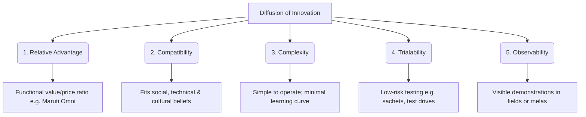

# Block 3 Notes (Hinglish): Marketing Mix Strategies

Yeh revision guide MMPM-008 ke **Units 8, 9, 10, aur 11** ke core concepts, frameworks, aur strategic case designs ko cover karti hai. Isko exam day par jaldi se scan aur revise karne ke liye design kiya gaya hai.

---

## Unit 8: Product and Service Decisions

### 1. Rogers' Diffusion of Innovation Framework
Rural markets mein naye product ya service ke adoption rate ko badhane ke liye use Rogers ke paanch perceived attributes of innovation par high score karna chahiye:

#### Services par iska Application:
* **Life Insurance:** Yeh introductory stage mein hai. Customers bohot risk-averse hote hain. Iska adoption badhane ke liye **trust** banana, terms ko simple karna, local agents (peer-to-peer) use karna, aur family security par focus karna zaroori hai.
* **Digital Payment Wallets:** Iske liye high technical compatibility chahiye. Marketers ko cash-only ki aadat ko todna padta hai. Iske adoption ko visual tutorials, secure transaction guarantees, aur high trialability (cashbacks, zero fees) se badhaya ja sakta hai.
* **Healthcare (Hospital Service Planning):** Gaon mein branch clinics setup karne ke liye:
  * **Innovators & Early Adopters:** Progressive farmers aur village Sarpanchs ko sabse pehle target karein (e.g. free health camps ke zariye) taaki local trust bane.
  * **Early & Late Majority:** Yeh log tabhi aayenge jab early adopters unhe checkup ke fayde batayenge (validation).
  * **Laggards:** Yeh log purane desi ilaj hi prefer karte hain. Inke liye ghar-ghar jaakar counseling karna aur mobile health vans chalana padta hai.

---

### 2. Packaging Adaptations
Low media exposure wale rural markets mein packaging ek **"silent salesman"** ki tarah kaam karta hai:
* **Small Package Sizes (SKU Revolution):** Low daily income aur trial risk kam rakhne ke liye sachet sizes (e.g. Chik shampoo, small soaps) bohot chalte hain.
* **Reusable Containers:** Consumer ko lagta hai ki use extra value mili hai agar plastic bottles, paint buckets, ya PET jars khali hone ke baad kitchen mein dibbe ki tarah use ho sakein.
* **Color and Design Semiotics:** Bright colors aur clean symbols primary identification ka kaam karte hain (e.g., Brooke Bond Red Label, Gemini Tea ka hathi wala logo, Eveready ka billi wala symbol).

---

### 3. Spurious (Counterfeit) Products ke khilaf kadam
Spurious (nakli) products rural markets mein bohot badi problem hain kyunki kam-padhe log brand names ke spellings mein farq nahi kar paate.

#### Marketer ke main Measures:
* **Strong Semiotics:** Text ke bajaye unique shapes, colors, aur symbols (e.g., Fevicol ka hathi) par rely karna.
* **Holographic aur Tamper-evident Seals:** Aisi packaging seals banana jinki copy karna bohot mushkil ho.
* **Dealer Network Control:** Retailers ka regular audit karna aur uniform pricing aur regular supply maintain karna (taaki stockout ke waqt nakli brands retail shelves par na aa sakein).
* **Consumer Awareness Campaigns:** Local street plays (Nukkad Nataks) ke zariye batana ki original aur duplicate mein kya farq hai.

---

### 4. Product Differentiation ke Examples
* **Godrej No.1:** Soap ki quality high (Grade 1) rakhi par unit size aur price kam kar diya taaki affordable rahe.
* **Eveready Torches:** Plastic ke bajaye brass (pital) bodies banayi kyunki rural consumers metal ke weight ko durability se jodte hain aur kharab hone par kabadi ko bech kar salvage value bhi mil jati hai.

---

## Unit 9: Pricing Decisions

### 1. Promotional Pricing
* **Trial Bundles:** Trial promote karne ke liye chote packs ko combine karna (e.g., HUL's Project Bharat Rs. 15 bundle jismein shampoo, talc, cream, aur toothpaste ek sath the).
* **Harvest Schemes:** Harvest (fasal katne) ke time jab farmers ke paas paisa aata hai, tab special discounts ya flexible payment schemes offer karna.

### 2. Competitive Pricing
* Local products aur duplicates se compete karne ke liye margins low rakhna. Kisi bhi extra price premium ko justify karne ke liye value-for-money dikhana zaroori hai.

### 3. Sales Promotion Methods
* **Direct Demonstrations:** Water pumps, tractors, ya kitchen appliances ki field mein live performance dikhana.
* **Mela-centric Schemes:** Local fairs mein games, lucky draws, aur exchange offers ke zariye engagement badhana.

---

## Unit 10: Integrated Marketing Communications (IMC)

### 1. Melas aur Haats ka Importance
Weekly markets (*Haats*) aur annual fairs (*Melas*) communication ke main centers hain:
* **Direct Experience:** Touch, feel, aur sensory testing enable karte hain.
* **Interactive Demos:** High-involvement durables aur agricultural tools ke liye best space hain.
* **Community Validation:** Tyohar ke mahol mein log pure group ke sath aate hain aur ek dusre se discuss karke shopping karte hain.

---

### 2. IMC Case Study Frameworks
Communication campaigns design karte waqt:

| Objective | SUV Launch (Passenger Vehicle) | Smart Irrigation Launch (e.g. Flexnet) |
| :--- | :--- | :--- |
| **Campaign Objectives** | Vehicle ko family aur commercial dono multi-utility ke liye position karna. | Water conservation aur high yield (fasal paidawar) par educate karna. |
| **Multilingual Themes** | Regional language mein taglines jo status, space, aur durability ko target karein. | Dialects mein crop safety aur soil health samjhane wale themes. |
| **Media Selection** | YouTube video ads, mobile vans, wall paintings, district melas mein display. | Demonstration plots, cooperative societies, weekly haat stalls. |
| **Measuring Effectiveness** | Test-drives aur dealer footfalls ko track karna. | Local queries aur discount coupons ki redemption rate check karna. |

---

## Unit 11: Maruti Suzuki Case Study

* **GP & Tehsil Focus:** Pehle Gram Panchayat level par contact banaya, uske baad tehsil level par sales hubs setup kiye.
* **Niche Segmentation:** 350 se zyada micro-segments (e.g., Tamil Nadu ke haldi ugane wale farmers, Kashmir ke apple growers) ko customize messages se target kiya.
