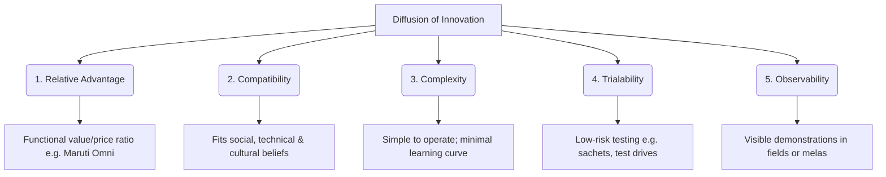

# Block 3 Notes: Marketing Mix Strategies

This revision guide covers the core concepts, frameworks, and strategic case designs from **Units 8, 9, 10, and 11** of MMPM-008. It is designed for quick scanning and high retention on exam day.

---

## Unit 8: Product and Service Decisions

### 1. Rogers’ Diffusion of Innovation Framework
To accelerate the rate of adoption of a new product or service in rural markets, it must score high on Rogers' five perceived attributes of innovation:

#### Application to Services:
* **Life Insurance:** Positioned in the introductory stage. Marked by high customer risk-aversion. Adoption is driven by building **trust**, simplifying terms, using local agents (peer-to-peer), and emphasizing family security.
* **Digital Payment Wallets:** Requires high technical compatibility. Marketers must overcome the cash-only habit. Adoption is accelerated by visual tutorials, secure transaction guarantees, and high trialability (cashbacks, zero fees).
* **Healthcare (Hospital Service Planning):** For setting up village branch clinics:
  * **Innovators & Early Adopters:** Progressive farmers and village Sarpanchs should be targeted first with free health checkup camps to build local trust.
  * **Early & Late Majority:** Will adopt based on the validation and reviews of the early adopters.
  * **Laggards:** Reluctant to leave traditional remedies. Require extensive home-visit persuasion and mobile health vans.

---

### 2. Packaging Adaptations
Packaging acts as a **"silent salesman"** in rural markets where media exposure is low:
* **Small Package Sizes (SKU Revolution):** Driven by low daily income and a desire to limit trial risks (e.g. sachet sizes of Chik shampoo, Godrej soaps).
* **Reusable Containers:** Consumers feel they get extra value if plastic bottles, paint buckets, or PET containers can be repurposed for kitchen storage.
* **Color and Design Semiotics:** Bright colors and simple icons serve as primary identifiers (e.g., Brooke Bond Red Label, Gemini Tea elephant logo, Eveready cat symbol).

---

### 3. Combatting Spurious (Counterfeit) Products
Spurious products are a menace because low-literacy consumers struggle to differentiate brand spellings.

#### Marketer Measures:
* **Strong Semiotics:** Relying on unique shapes, colors, and symbols (e.g., Fevicol elephant) rather than text.
* **Holographic and Tamper-evident Seals:** Hard-to-replicate packaging seals.
* **Dealer Network Control:** Regular audits of local retailers and ensuring uniform pricing/regular supplies (avoiding stockouts that give duplicates an entry).
* **Consumer Awareness Campaigns:** Local street plays (Nukkad Nataks) showing how to spot originals.

---

### 4. Product Differentiation Examples
* **Godrej No.1:** Kept quality high (Grade 1 soap) but reduced unit size and price to keep it affordable.
* **Eveready Torches:** Changed from plastic to brass bodies because rural consumers associate metal weight with durability and salvage scrap value.

---

## Unit 9: Pricing Decisions

### 1. Promotional Pricing
* **Trial Bundles:** Grouping low-unit packs to encourage trial (e.g., HUL's Project Bharat Rs. 15 bundle containing shampoo, talc, cream, and toothpaste).
* **Harvest Schemes:** Offering discounts or payment flexibilities timed with post-harvest cash flows.

### 2. Competitive Pricing
* Keeping margins low to compete with regional players and duplicates. Marketers must offer higher value-for-money to justify any price premium.

### 3. Sales Promotion Methods
* **Direct Demonstrations:** Showing pump performance, tractor mileage, or cooking equipment utility.
* **Mela-centric Schemes:** Interactive games, lucky draws, and exchange offers during local fairs.

---

## Unit 10: Integrated Marketing Communications (IMC)

### 1. Significance of Melas and Haats
Weekly markets (*Haats*) and annual fairs (*Melas*) are vital communication nodes:
* **Direct Experience:** Allows sensory testing (touch, see, hear).
* **Interactive Demos:** Ideal for high-involvement durables and agricultural products.
* **Community Validation:** Group purchases are made in a festive, trust-building atmosphere.

---

### 2. IMC Case Study Frameworks
When designing communication campaigns:

| Objective | SUV Launch (Passenger Vehicle) | Smart Irrigation Launch (e.g. Flexnet) |
| :--- | :--- | :--- |
| **Campaign Objectives** | Position vehicle for multi-utility (family & commercial transport). | Educate on water conservation & yield growth. |
| **Multilingual Themes** | Regional taglines focused on prestige, space, and durability. | Themes detailing crop safety and soil health in local dialects. |
| **Media Selection** | YouTube video ads, mobile vans, wall paintings, display at district melas. | Demonstration plots, cooperative societies, weekly haat stalls. |
| **Measuring Effectiveness** | Tracking test-drive registrations and dealership footfalls. | Monitoring local query volume and coupon redemption rates. |

---

## Unit 11: Maruti Suzuki Case Study

* **GP & Tehsil Focus:** Reached Gram Panchayat members to seed interest, then set up localized sales hubs at the tehsil level.
* **Niche Segmentation:** Reached over 350 micro-segments with tailored messages (e.g., turmeric farmers in Tamil Nadu, apple growers in Kashmir).
