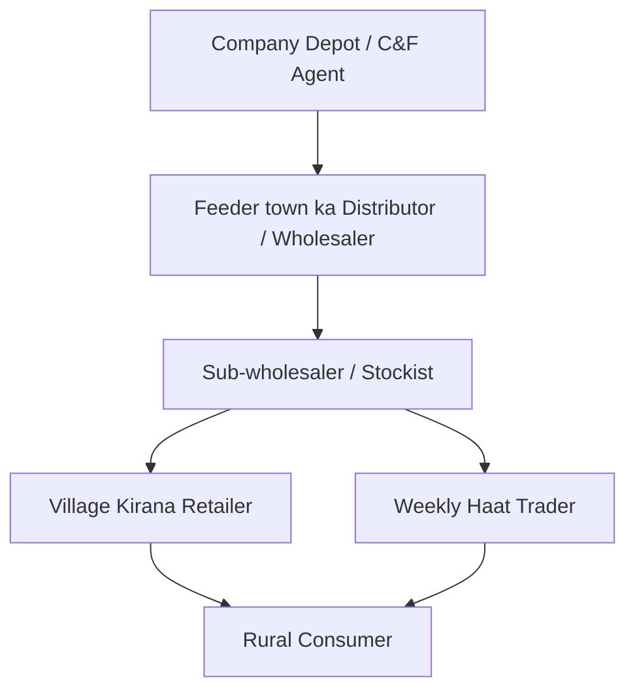

# Block 4 Notes (Hinglish): Accessing Rural Markets

Yeh revision guide MMPM-008 ke **Units 12, 13, 14, aur 15** ke core concepts, channel hierarchies, logistics strategies, aur distribution case studies ko cover karti hai. Isko exam day par jaldi se scan aur revise karne ke liye design kiya gaya hai.

---

## Unit 12: Physical Infrastructure and Dynamics of Distribution

### 1. Dynamics of Physical Distribution
India ke highly dispersed (door-door bikhre) villages tak pahunchne mein (jahan population 2,000 se kam ho) bade logistics barriers aate hain. Main variable factors mein village dispersal, road quality, power grid cuts, aur warehousing capacity main hain.

---

### 2. Seasonal Demand aur iske Distribution Implications
Rural demand kheti ke harvest (fasal katne ke) cycle se heavily linked hai, jisse logistics aur warehousing mein unique challenges aate hain:

* **The Problem:**
  * **Income Seasonality:** Cash inflows main roop se harvest ke baad hote hain (Kharif: Oct-Nov; Rabi: April-May), jisse durables aur kapdo ki demand achanak bohot badh jati hai.
  * **Monsoon Bottlenecks:** Baarish ke season mein kheti ki sowing activity toh high hoti hai par mud roads (*kachha* raste) kharab ho jane se logistics ruk jata hai.
* **Marketers' Logistics Strategy:**
  * **Advance Warehousing:** Monsoon shuru hone se pehle hi feeder towns ya district hubs par buffer stocks pahunchana.
  * **Inventory Forecasting:** Fasal ki yield (paidawar) ke according distributors ki stock capacity forecast karna.
  * **Flexible Transportation:** Last-mile delivery ke liye tractors, local small vans, ya animal carts jaise flexible transport vehicles use karna.

---

## Unit 13 & 14: Participants aur Retailing Strategies

### 1. Hierarchy of Intermediaries
Village level tak pahunchne ke liye rural distribution channels multi-tiered hote hain:

* **Feeder Towns:** Chote semi-urban market hubs jahan se village retailers wholesale mal kharidte hain.
* **Kirana Shops:** Gaon ke andar choti family-run shops.
* **Periodic Markets (Haats):** Weekly lagne wale bazaar jahan ghumne wale (mobile) traders temporary stalls lagate hain.

---

### 2. Rural Channels mein Power Dynamics
Rural distribution mein power ab wholesale se shift hokar **Village Kirana Retailer** ke haath mein ja rahi hai:

* **Credit Provision:** Retailers gaon ke logon ka *Khata* (udhar book) chalate hain, jisse customer unke sath bandh jata hai.
* **Brand Influence:** Low literacy ki wajah se consumers aksar brand name nahi balki category demand karte hain (e.g. "lal sabun"). Aise mein retailer jo brand deta hai, consumer wahi leta hai.
* **Assortment Control:** Retailer ke paas space kam hoti hai, isliye wahi decide karta hai ki kaunsa brand display aur stock karega.

---

### 3. Channel Member Performance ko Monitor aur Assess karna
Household consumer durables (gas burners ya pressure cookers) bechne ke liye, marketers ko is scorecard parameters par kaam karna chahiye:

| Evaluation Metric | Description | Justification |
| :--- | :--- | :--- |
| **Sales Target Volume** | Monthly/Seasonal sales targets kitne complete hue. | Pata chalta hai ki dealer kitna market demand capture kar raha hai. |
| **Credit & Payment Promptness** | Dealer invoice settlement kitne time mein kar raha hai. | Credit rotation control karta hai aur bad debts se bachata hai. |
| **Shelf & Display Allocation** | Counter/shop par brand ko kitna space aur visibility di gayi. | Customer ki impulse buying aur recall badhane ke liye zaroori hai. |
| **Stockout Frequency** | Dealer kitni baar product out-of-stock hota hai. | Stockout hone par customer competitor ya spurious (duplicate) product le sakta hai. |
| **Customer Service Feedback** | Installation assist, repairs, aur consumer complaints kaise handle kiye. | Brand trust banaye rakhta hai aur positive local WOM (word-of-mouth) badhata hai. |

---

### 4. Retailing & Retailing Outlets
* **Place Utility:** Product ko consumer ke jitna ho sake paas available karana taaki uska travel cost aur time bache.
* **Co-operatives & PDS ka use:** Government networks jaise Fair Price Shops ya cooperative societies ko products store aur distribute karne ke liye use karna.

---

## Unit 15: Case Study: HUL Project Shakti

Project Shakti ek model case study hai jo batati hai ki kaise Hindustan Unilever Ltd (HUL) ne 2,000 se kam population wale door-daraz ke villages tak apna direct distribution network pahunchaya jahan standard delivery vans jana profitable nahi tha.

### 1. Shakti Model
HUL **Self-Help Groups (SHGs)** ke sath collaborate karke gaon ki women ko select karta hai aur unhe **Shakti Ammas** (micro-entrepreneurs) banata hai. HUL unhe direct products bechta hai aur woh gaon-gaon mein local homes ko supply karti hain.

### 2. SHGs use karne ke Fayde (Opportunities)
* **Untapped Reach:** Standard distribution se bache hue chote, dispersed markets tak pahunch.
* **High Local Trust:** Shakti Amma usi gaon ki resident hoti hai, isliye uski recommendations par logo ka trust bohot zyada hota hai.
* **Social & Economic Empowerment:** Rural families ko extra income milti hai aur women ka financial decision capacity badhta hai.

### 3. Problems aur Challenges
* **Training & Onboarding Costs:** Stock manage karne, billing, aur product pitch sikhane ke liye continuous training ki zaroorat padti hai.
* **Logistical Complexity:** Shakti Ammas tak inventory pahunchane ke liye ek bada feeder system (**Operation Streamline**) chalana padta hai.
* **Credit and Capital Limits:** Shakti Ammas ke paas working capital limited hota hai, isliye woh ek baar mein bada stock nahi le patin.

### 4. Strategic Recommendations
* **Digital Integration:** Shakti Ammas ko simple mobile apps dena taaki orders aur stock live track ho sakein.
* **Simplified Portfolio:** Premium items ke bajaye sirf fast-moving daily use goods (Lifebuoy, Wheel, Clinic Plus) bechne par focus rakhna.
* **Stock Consolidation:** Shakti Ammas ko direct pass ke feeder-town stockist se connect kar dena taaki low-cost aur quick restocking ho sake.
