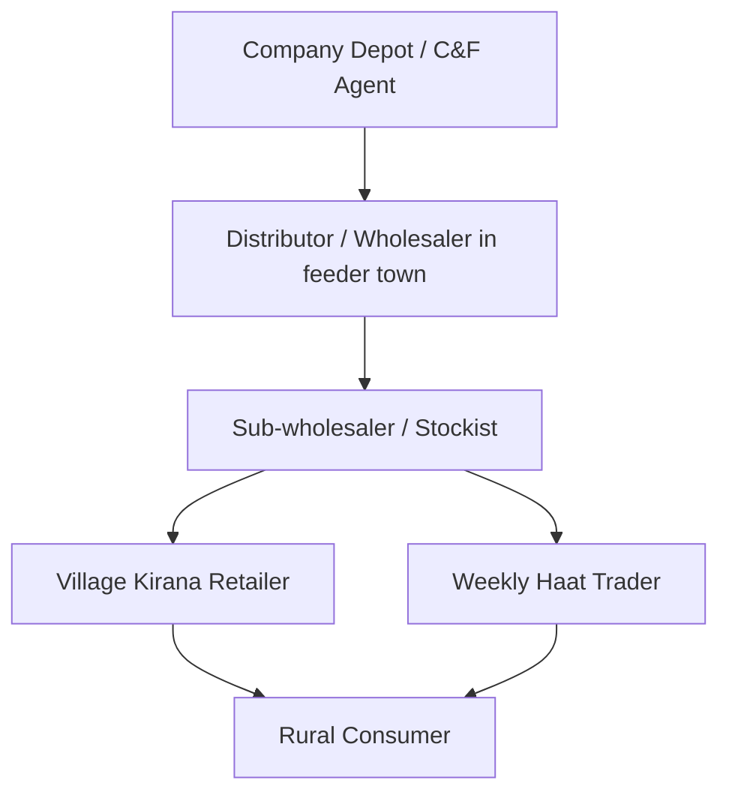

# Block 4 Notes: Accessing Rural Markets

This revision guide covers the core concepts, channel hierarchies, logistics strategies, and distribution case studies from **Units 12, 13, 14, and 15** of MMPM-008. It is designed for quick scanning and high retention on exam day.

---

## Unit 12: Physical Infrastructure and Dynamics of Distribution

### 1. Dynamics of Physical Distribution
Reaching India's highly dispersed villages (many with populations under 2,000) presents major logistics barriers. Key variables include village dispersal, road quality, power grid reliability, and warehousing capacity.

---

### 2. Seasonal Demand and Distribution Implications
Rural demand is heavily tied to the agriculture harvest cycle, creating unique logistics and warehousing challenges:

* **The Problem:** 
  * **Income Seasonality:** Cash inflows occur primarily post-harvest (Kharif: Oct-Nov; Rabi: April-May), causing sharp demand spikes for durables and clothes.
  * **Monsoon Bottlenecks:** The rainy season coincides with high sowing activity but turns mud roads (*kachha* roads) impassable, halting logistics.
* **Marketers' Logistics Strategy:**
  * **Advance Warehousing:** Positioning buffer stocks at regional hubs (tehsil/district level) before the monsoons begin.
  * **Inventory Forecasting:** Matching distributor stocking capacity with seasonal crop outputs.
  * **Flexible Transportation:** Utilizing specialized delivery fleets (tractors, local vans, or animal carts) for last-mile connectivity over broken roads.

---

## Unit 13 & 14: Participants and Retailing Strategies

### 1. Hierarchy of Intermediaries
Distribution in rural markets involves multi-tiered channel configurations to reach the village level:

* **Feeder Towns:** Semi-urban market hubs where village retailers go to buy stocks.
* **Kirana Shops:** Small, family-run retail stores inside the village.
* **Periodic Markets (Haats):** Weekly marketplaces where mobile traders set up stalls.

---

### 2. Power Dynamics in Rural Channels
The power in rural distribution is increasingly shifting toward the **Village Kirana Retailer**:

* **Credit Provision:** Retailers maintain a *Khata* (credit book) system for villagers, securing high customer lock-in.
* **Brand Influence:** Due to low literacy, consumers often ask for a product category (e.g. "red soap") rather than a brand. The retailer recommends the brand, acting as a gatekeeper.
* **Assortment Control:** Retailers have limited shelf space and storage; they choose which brands to display and stock.

---

### 3. Monitoring and Assessing Channel Performance
For distributing household consumer durables (e.g., gas burners or pressure cookers), marketers should use a balanced evaluation scorecard:

| Evaluation Metric | Description | Justification |
| :--- | :--- | :--- |
| **Sales Target Volume** | Monthly/Seasonal sales numbers achieved. | Measures market demand capture. |
| **Credit & Payment Promptness** | Time taken by dealers to settle invoices. | Protects company cash flow and reduces bad debts. |
| **Shelf & Display Allocation** | Physical space and prominent positioning given to the product. | Crucial for generating top-of-mind recall at checkout. |
| **Stockout Frequency** | How often the dealer runs out of inventory. | High stockouts push consumers to purchase competitor/duplicate items. |
| **Customer Service Feedback** | Handling of product complaints, installation help, and repair requests. | Maintains brand trust and positive local word-of-mouth. |

---

### 4. Retailing & Retailing Outlets
* **Place Utility:** Creating value by making products available close to the consumer, saving travel time and costs.
* **Utilizing Co-operatives & PDS:** Leveraging government-backed networks like Fair Price Shops or agricultural credit cooperatives to store and distribute consumer products.

---

## Unit 15: Case Study: HUL Project Shakti

Project Shakti is a case study of how Hindustan Unilever Ltd (HUL) cracked last-mile distribution to tiny villages (populations < 2,000) where traditional distributor vans could not operate profitably.

### 1. The Shakti Model
HUL partners with **Self-Help Groups (SHGs)** to identify rural women, who are then appointed and trained as **Shakti Ammas** (entrepreneurs). HUL sells products directly to them, and they sell to households in their own and neighboring villages.

### 2. Opportunities of using SHGs
* **Untapped Reach:** Accesses highly dispersed micro-markets.
* **High Local Trust:** A Shakti Amma is a neighbor; her brand recommendations have high credibility and word-of-mouth validation.
* **Social & Economic Empowerment:** Provides critical supplementary income to rural families, enhancing women's status.

### 3. Problems and Challenges
* **Training & Onboarding Costs:** Requires continuous education on inventory control, billing, and sales pitches.
* **Logistical Complexity:** Keeping hundreds of thousands of Shakti Ammas stocked requires a complex, multi-tiered feeder system (**Operation Streamline**).
* **Credit and Capital Limits:** Shakti Ammas operate with limited cash, restricting their capacity to hold stock.

### 4. Strategic Recommendations
* **Digital Integration:** Providing Shakti Ammas with simple mobile apps for order booking and inventory tracking.
* **Simplified Portfolio:** Focusing only on high-turnover daily items (Lifebuoy, Wheel, Clinic Plus) rather than premium lines.
* **Stock Consolidation:** Linking Shakti Ammas directly with nearby feeder-town sub-wholesalers for quick, low-cost restocking.
