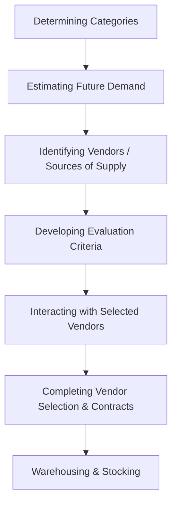
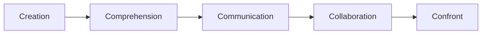

# Block 4 Revision Notes: Retail Operations, Sourcing, and CRM (Hinglish)

## Unit 13: Managing Store Operations

### 1. Retail Store Operations (Rsop)
Retail Store Operations (Rsop) ka matlab un saari daily activities se hai jo store ko smoothly run karne, customers ko satisfy karne, aur store ki profitability ko optimize karne ke liye zaroori hain.

#### Operational Comparison: Multibrand Footwear Retailer vs. Single-Brand White Goods Retailer
Daily operations ka scope aur nature merchandise characteristics, customer involvement levels, aur SKU complexity ke base par badalta hai.

| Operational Area | Multibrand Footwear Retailer | Single-Brand Retailer of White Goods (Refrigerators, ACs, TVs) |
| :--- | :--- | :--- |
| **SKU Complexity** | **Very High**: Dozens of brands, styles, colors, aur har style ke multiple sizes. | **Low**: Kisi ek manufacturer ke unique models/variants ki limited quantity. |
| **Store Layout & Flow** | **Grid or Free-Flow**: Product fittings ke liye clear walking space, aisles, aur seating zones ki zaroorat hoti hai. | **Spaced-Out or Racetrack**: Bade physical items ko accommodate karne ke liye wide spacing ke sath open displays chahiye. |
| **Display & VM** | Mirrored showcases, wall racks, slatwall panels, aur sizes show karne ke liye shelf tagging. | Live demos ke liye high-quality spot lighting, functional mockups, aur power outlets. |
| **Salesperson Role** | **High Touch / Low Tech**: Sizes locate karne, back store-room se stock lane, aur feet fitting mein help karna. | **Consultative / High Tech**: Specifications, energy efficiency, features, aur warranties ko explain karna. |
| **Inventory Storage** | **Split Space**: Ek bada backend store-room jisme shoe boxes stock kiye ja sakein. | **Display-Only Floor**: Floor par sirf display models hote hain; customer orders central warehouse se fulfill kiye jaate hain. |
| **Transaction Dynamics** | Low-to-medium value transactions ka high volume, jisme size issues ke karan frequent returns hote hain. | High-value transactions ka low volume; low return rates, par financing/credit arrangements complex hote hain. |
| **Delivery & Setup** | Customer dwara turant cash-and-carry. | Retailer dwara coordinated home delivery, transit logistics, installation, aur post-sale technical setup. |
| **Security & Shrinkage** | Small items hone ke karan shoplifting risk high hota hai. RFID tags aur CCTV ka use kiya jata hai. | Item size bada hone ke karan minimal shoplifting risk. Security focus employee theft aur transit pilferage par hota hai. |

### 2. The Consumer's Angle: Environmental Stimuli
Retail environment ko is tarah se design kiya jata hai jo specific consumer behaviors ko stimulate kare, approach (lamba stay, browsing, buying) ya avoidance ko encourage karte hue.
* **Pleasure-Displeasure**: Shopper ko store environment enjoyable lagta hai ya nahi.
  * *Example*: Local shoppers ke demographics (jaise regional preferences) ke according background music set karne se pleasure directly enhance hota hai.
* **Arousal**: Environment kitna stimulation provide karta hai.
  * *Example*: Upbeat aur fast music activity & browsing speed ko badhata hai, jabki slow & calm music pace ko subdue karta hai, jisse log restaurants mein zyada der stay karte hain.
* **Dominance**: Kya customer space mein in-control feel karta hai (dominant) ya submissive feel karta hai (under control).
  * *Example*: Higher ceilings ya grand architecture customers ko submissive feel kara sakte hain. Color choices bhi mood ko dictate karti hain: **Red** active, assertive, aur rebellious emotions ko trigger karta hai, jabki **Blue** tranquility (shanti) aur suppressed feelings ko represent karta hai.

---

## Unit 14: Sourcing and Inventory Management

### 1. Sourcing Process Steps
Sourcing procurement ka ek strategic process hai jahan retailer merchandise buy karne ke liye vendors ko identify, evaluate, aur select karta hai.

1. **Determining the Categories**: Substitutable (ek dusre ki jagah use hone wale) products ke manageable groups ko define karna (jaise men’s, ladies, sports, aur kids' bicycles).
2. **Estimating Future Demand**: Historical sales data, industry reports, search engine trends (Google/Yahoo), aur social media feedback ko analyze karke expected sales volume ko forecast karna.
3. **Identifying Vendors or Sources of Supply**: Turnover ke according authorized dealers, wholesale markets (food grains ke liye local mandis), ya direct manufacturers se sourcing karna.
4. **Developing Evaluation Criteria**: Vendors ko compare karne ke liye ek weighted scoring framework banana.
   $$\text{Final Vendor Score} = \sum (\text{Criteria Score } [1\text{-}10] \times \text{Priority Weight } [1\text{-}5])$$
   *Criteria mein shamil hain*: product quality, price, delivery lead time, transport costs, aur packaging quality.
5. **Interaction with Selected Vendors**: Retailer ke requirements ke according vendor capabilities ko align karne ke liye briefings conduct karna, demos dekhna, aur solutions verify karna.
6. **Completing Vendor Selection & Contracts**: Supply disruption ke risks ko kam karne ke liye primary aur secondary vendors select karna, aur terms, costs, return policies & delivery deadlines define karne wale written contracts sign karna.
7. **Warehousing & Stocking**: Shipments receive karna, received goods ko invoices aur purchase orders se match karna, damaged ya deficient goods ko identify karna, aur payments initiate karna.

### 2. Vendor Negotiation & Relationship Management (VRM)
* **Negotiation Factors**:
  * *Complete Information*: Vendor ki location, size, aur supply track record ko research karna.
  * *Situation Analysis of a Product*: Brand ki market image ka ground-level assessment karna.
  * *Target Setting of Contract Items*: Payment terms, freight, aur return guidelines ke liye clear checklists.
  * *Deadlines for Delivery*: Stockouts ko rokne ke liye firm, mutually agreed-upon delivery dates.
* **Vendor Relationship Management (VRM)**: Mutual goals ko achieve karne ke liye buyer-vendor relationships ko strong banana.
  * *Benefits*: Cost of ownership mein reduction, product innovations, smoother data flow, aur supply chain risk mitigation.
  * *Cloud Shift*: Modern VRM systems cloud portals use karte hain taaki onboarding automated ho sake, real-time tracking ho sake, aur automated payments check ho sakein.
* **Vendor-Managed Inventory (VMI) & VOIM**:
  * *VMI*: Supplier/manufacturer retailer ki inventory ko replenish karne ki responsibility leta hai, POS data ko **Electronic Data Interchange (EDI)** ke through electronically access karte hue.
  * *Vendor-Owned Inventory Management (VOIM)*: Vendor stock ki ownership aur replenishment responsibilities khud hold karta hai jab tak stock shelves par rehta hai aur customer ko sell nahi ho jata.

### 3. Inventory Management: Reordering & Reports
* **Inventory Report**: SKU level par stock status ki ek summary.
  * *Usage*: Retailer ko batata hai ki demand meet karne ke liye kaun sa assortment aur kitni quantity purchase karni hai, inventory movement ko track karta hai, aur discrepancies (shrinkage) ko identify karta hai.
* **Product Availability Report**: Jab customer ne kisi product ki demand ki, to wo shelf par kitne percent time available tha, iska monthly average track karta hai.
* **Reorder Level (ROL)**: Woh stock level jisse niche kisi SKU ki quantity nahi jani chahiye; is level par aate hi replenishment order trigger ho jata hai.
  $$\text{Reorder Level} = \text{Minimum Safety Stock} + (\text{Sales Rate per Day} \times \text{Lead Time in Days})$$
  *Example*: Ek grocery retailer shelf par minimum 50 units detergent rakhna chahta hai. SKU ki sales 15 units per day hai, aur vendor ka lead time 7 days hai.
  $$\text{Reorder Level} = 50 + (15 \times 7) = 155 \text{ units}$$
* **Order Quantity**: Yeh sales frequency, warehouse storage capacity, inventory mein block karne ke liye available capital, aur anticipated shortages se determine hota hai.

### 4. Shrinkage in Retail Inventory Management
* **Definition**: Shoplifting (bahar ki chori), employee theft (andar ki chori), misplacement, ya damaged goods ke karan inventory mein hone wala nuksan. Isko aise measure karte hain:
  $$\text{Shrinkage} = \text{Book Inventory Value (from Purchase Records)} - \text{Physical Inventory Value}$$
* **Transit Shrinkage**: Vendor aur store ke beech transport ke dauran choti quantities mein goods ka pilferage (chori) hona.
* **Mitigation Strategies**:
  * Visual CCTV surveillance install karna.
  * Electronic tracking tags jaise **RFID (Radio Frequency Identification)** use karna (expensive par highly effective).
  * Sirf credible transport agencies ke sath partner karna.
  * Purchasing contracts ke through vendors ke sath inventory security ki responsibility share karna.

### 5. Merchandise Performance Evaluation Tools
* **Sales Analysis**:
  * *Actual vs. Target*: $\frac{\text{Actual Sales}}{\text{Targeted Sales}} \times 100$
  * *Average Inventory Investment*: Hold ki gayi inventory ki mean value.
    $$\text{Average Inventory} = \frac{\text{Beginning Inventory (BI)} + \text{Ending Inventory (EI)}}{2}$$
  * *Inventory Turnover Ratio (ITR)*: Ek specific period mein inventory kitni baar sell hoti hai.
    $$\text{Inventory Turnover Ratio} = \frac{\text{Cost of Goods Sold (COGS)}}{\text{Average Inventory (at Cost)}}$$
  * *Sell-Through Rate*: Received stock mein se kitna percent becha gaya (sold).
    $$\text{Sell-Through Rate \%} = \frac{\text{Units Sold}}{\text{Received Units}} \times 100$$
* **Gross Margin Return on Investment (GMROI)**: Inventory profitability ko measure karta hai.
  $$\text{GMROI} = \frac{\text{Total Gross Margin}}{\text{Average Inventory Cost}}$$
  *Example*: Retailer ek week mein 1,000 units bechta hai. Selling price = Rs. 75, Cost = Rs. 50. Total Gross Margin = $(75 - 50) \times 1,000 = \text{Rs. } 25,000$. Average inventory cost Rs. 8,000 hai.
  $$\text{GMROI} = \frac{25,000}{8,000} = 3.125$$
  (Retailer inventory mein invest kiye gaye har ek Rupee par Rs. 3.125 earn karta hai).
* **ABC Analysis**: Pareto Principle (80/20 rule, jahan ~80% profits ~20% items se aate hain) ke base par inventory ko classify karna.
  * **A-Inventory**: Top 20% SKUs jo ~80% sales/profits generate karte hain. Inhe highest priority aur tightest control diya jata hai, aur yeh rarely out-of-stock hone chahiye.
  * **B-Inventory**: Medium-value items (~30% SKUs jo ~15% profits generate karte hain). Yeh regularly sell hote hain par inme moderate carrying costs hoti hain.
  * **C-Inventory**: Low-value items (~50% SKUs jo sirf ~5% profits generate karte hain). Inhe obsolescence ke liye check kiya jata hai aur discontinuation ke liye consider kiya jata hai.

---

## Unit 15: Managing People and Processes

### 1. Extended Retail marketing Mix (7Ps)
Retailing, ek service-intensive sector hone ke karan, extended marketing mix par rely karta hai:
* **Core 4Ps**: Product, Price, Place, Promotion.
* **Extended 3Ps**:
  1. **People**: Employees, management, store culture, aur customer service.
  2. **Process**: Services kaise consume hoti hain, transactions kaise complete hote hain, aur goods kaise move karte hain, iska workflow.
  3. **Physical Evidence**: Store ka environment, design, comfort, aur interfaces.

### 2. People Management (The 5Cs Approach)
Retail human resources ko manage karna unique challenges lata hai: 24/7 work schedules, stressful customer-facing interactions, aur ek volatile, uncertain, complex, aur ambiguous (VUCA) environment mein high employee turnover rates.

* **Creation**: First hire se hi vision, mission, aur company culture ko set karna. Talent ko attract karne ke liye ek strong employer brand aur meritocracy build karna.
* **Comprehension**: Individual differences aur skills ko appreciate karna. Custom motivation, compensation, aur training structures design karna, aur employees ko humanistic tarike se handle karna.
* **Communication**: Ek open culture foster karna jahan employees ki aawaz suni jaye (feel heard). Effective conflict resolution, downward/upward feedback, aur active listening ensure karna.
* **Collaboration**: Team camaraderie (bhaichara), mutual trust, aur ek shared vision build karna jahan employees routine tasks se aage apni value samajh sakein.
* **Confront**: VUCA challenges aur interpersonal conflicts se confront (muqabla) karne ke liye organizational resilience build karna, aur zaroori proactive disciplinary actions lena.

#### Key People Management Skills
1. *Cohesiveness & Trust-Building*: Tight-knit, motivated teams banane ke liye active listening aur empathy.
2. *Active Listening & Mediation*: Interpersonal conflicts ko early stage par hi resolve karna isse pehle ki wo service quality ko affect karein.
3. *Knowledge-Setting & Organization*: Data-driven feedback, performance analytics, aur employees ki career development ke opportunities ensure karna.
4. *Visionary Leadership*: Workloads ko streamline karna, operational clutter ko eliminate karna, aur resource needs ko anticipate karna.

### 3. Process Management
Process steps aur decisions ki ek series hoti hai jo kam ko complete karne ke tarike mein shamil hoti hai.
* **Goal**: Consistent service delivery jo is baat se affect na ho ki use kaun sa staff member perform kar raha hai.
* **The 7Rs**: **Right Product**, **Right Quantity** mein, **Right Condition** mein, **Right Time** par, **Right Place** par, **Right Customer** ko, aur **Right Price** par milna ensure karna.

#### Simplified Retail Process Model
1. **Plan**: Market demand ko identify karna aur product assortments determine karna (kya, kab, aur kitna stock karna hai).
2. **Buy**: Merchandise planning, pricing negotiations, aur vendor credit terms ko execute karna.
3. **Move**: Logistics, warehouses, aur suppliers se lekar shelves tak inventory flow ko manage karna.
4. **Market**: Branding, promotions, quality standards, aur delivery terms ko decide karna.
5. **Sell**: In-store ya online sales, checkout tender processes, installation, aur after-sales service ko execute karna.

#### Interlink & Benefits of People and Process Management
* *Interdependence*: Competent log efficient processes design karte hain; structured processes ambiguity aur operational friction ko kam karke competent logo ko attract aur retain karti hain.
* *Benefits*:
  * **Streamlined Decisions**: Errors ko minimize karta hai, repetitive tasks ko automate karta hai, aur order cycles ko speed up karta hai.
  * **Enhanced Productivity**: Resource utilization ko maximize karta hai aur data loss ko prevent karta hai.
  * **Reduced Costs & Risks**: Employee turnover ko kam karta hai, supply chain risks ko kam karta hai, aur operating margins ko improve karta hai.

---

## Unit 16: Customer Relationship Management (CRM)

### 1. Introduction & Objectives of CRM
**Customer Relationship Management (CRM)** practices, strategies, aur technologies ka ek combination hai jise retail firms customer interactions aur data ko poore customer lifecycle ke dauran track, analyze, aur manage karne ke liye use karti hain.

* **Primary Retail Objectives**:
  1. *Improve Customer Experience*: Purchase history analysis ke through communications, services, aur offers ko personalize karna.
  2. *Increase Customer Retention*: Customer churn (ghatna/chhodna) ko minimize karne ke liye strong, long-term bonds build karna.
  3. *Boost Sales*: Cross-selling aur upselling ke opportunities ko identify karna.
  4. *Streamline Operations*: Lead generation, queries tracking, aur customer service ko automate karna.
  5. *Gain Insights*: Customers ko segment karna aur buying trends ko forecast karna.
* **Indian Loyalty Program Examples**:
  * *Reliance Fresh*: Reliance One points program.
  * *Westside*: Club West tier-based club memberships.
  * *Pantaloons*: Teen alag-alag loyalty levels mein categorized Green Cards.
  * *Tesco (Global)*: Clubcard database jise core strategic planning tool ke roop mein use kiya jata hai.

### 2. CRM Components and Implementation Roles
CRM systems touchpoints (website, phone, email, social media, POS) ke cross customer data ko compile karte hain taaki various retail functions ko assist kiya ja sake:

1. **Marketing Automation**: Repetitive campaigns ko automate karta hai, jaise jab naye prospects register karte hain to unhe promotional emails ya drip campaigns bhejna.
2. **Sales Automation**: Customer interactions ko track karta hai aur pipelines coordinate karta hai, jisse agents leads ko log kar sakein aur systematically follow up kar sakein.
3. **Contact Centre Automation**: Chatbots, pre-recorded IVR menus, aur desktop integrations implement karta hai taaki customer queries ko jaldi resolve kiya ja sake.
4. **Geo-Location / Location-Based Services**: Jab customers physical stores ke paas hote hain to unhe location-specific offers target karta hai.
5. **Process Automation**: Calendars, follow-up alerts, aur pipeline transitions ko automate karta hai taaki employees ka time free ho sake.
6. **Human Resource Management (HRM)**: Employee performance data ko customer satisfaction reports ke sath integrate karta hai.
7. **Analytics & AI Tools**: AI tools (jaise Zoho CRM mein Zia, ya Salesforce Einstein) use karta hai lead scores calculate karne, customer behavior predict karne, aur **product affinity** & **propensity-to-buy** analysis execute karne ke liye.

### 3. CRM System Benefits & Challenges
* **The Power of Retention**: Naye customers ko acquire karne se naye customer ki jagah purane (existing) customers ko retain karna bahut sasta hai. **Customer retention mein 5% increase** karne se customer net present value mein **25% se 95% tak ka increase** ho sakta hai (Ang & Buttle, 2006).
* **Personalization**: Behavioral data ko analyze karke retailers personalized product recommendations offer kar sakte hain, jo low-operating-margin environments ke liye bahut crucial hai.
* **CRM Affiliation**: Partnering with complementary businesses (e.g., a clothing store partnering with a shoe retailer) to cross-promote, run joint loyalty programs, and drive shared sales.
* **Implementation Challenges**:
  * *Data Quality*: Incomplete ya galat customer entries ke karan analytical output kharab hota hai.
  * *System Integration*: CRM databases ko alag sales POS, inventory software, aur shipping platforms ke sath merge karna.
  * *User Adoption*: Complex systems ke liye staff ko intensive training ki zaroorat hoti hai taaki customer interactions ki correct logging ensure ki ja sake.
  * *Privacy & Security*: Customer ki sensitive personal details aur transaction histories ko secure rakhna.
  * *Cost*: Small-to-medium retailers ke liye bahut high implementation, licensing, aur maintenance fees.
