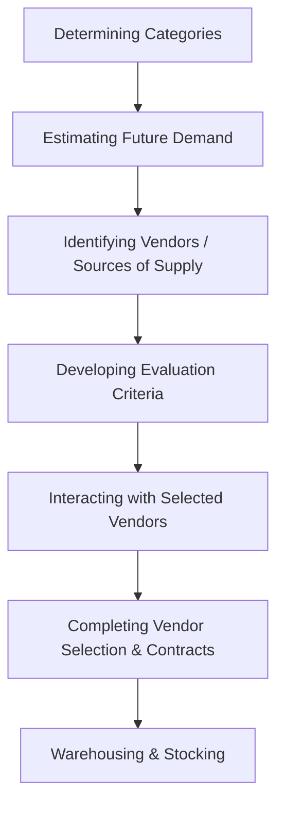
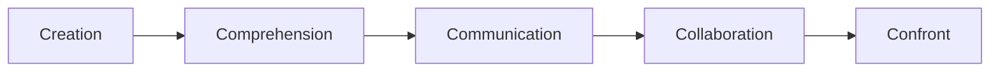

# Block 4 Revision Notes: Retail Operations, Sourcing, and CRM

## Unit 13: Managing Store Operations

### 1. Retail Store Operations (Rsop)
Retail Store Operations concerns all daily activities required to keep a store functioning smoothly, satisfying customers, and optimizing store profitability.

#### Operational Comparison: Multibrand Footwear Retailer vs. Single-Brand White Goods Retailer
The scope and nature of daily operations vary significantly based on merchandise characteristics, customer involvement levels, and SKU complexity.

| Operational Area | Multibrand Footwear Retailer | Single-Brand Retailer of White Goods (Refrigerators, ACs, TVs) |
| :--- | :--- | :--- |
| **SKU Complexity** | **Very High**: Dozens of brands, styles, colors, and multiple sizes per style. | **Low**: Limited number of unique models/variants from a single manufacturer. |
| **Store Layout & Flow** | **Grid or Free-Flow**: Needs clear walking space, aisles, and seating zones for product fittings. | **Spaced-Out or Racetrack**: Requires open displays with wide spacing to accommodate large physical items. |
| **Display & VM** | Mirrored showcases, wall racks, slatwall panels, and shelf tagging to show sizes. | High-quality spot lighting, functional mockups, and power outlets for live demos. |
| **Salesperson Role** | **High Touch / Low Tech**: Assistance in locating sizes, fetching stock from the back, and helping fit. | **Consultative / High Tech**: Explaining specifications, energy efficiency, features, and warranties. |
| **Inventory Storage** | **Split Space**: Significant space dedicated to a backend store-room containing shoe boxes. | **Display-Only Floor**: Store displays floor models; customer orders are fulfilled from a central warehouse. |
| **Transaction Dynamics** | High volume of low-to-medium value transactions with frequent returns due to size issues. | Low volume of high-value transactions; low return rates, but complex financing/credit arrangements. |
| **Delivery & Setup** | Immediate cash-and-carry by the customer. | Retailer-coordinated home delivery, transit logistics, installation, and post-sale technical setup. |
| **Security & Shrinkage** | High shoplifting risk of small items. Uses electronic tags (RFID) and CCTV. | Minimal shoplifting risk due to item size. Security focus is on employee theft and transit pilferage. |

### 2. The Consumer's Angle: Environmental Stimuli
The retail environment is designed to stimulate specific consumer behaviors, encouraging approach (prolonged stay, browsing, buying) or avoidance.
* **Pleasure-Displeasure**: Whether the shopper finds the store environment enjoyable.
  * *Example*: Fitting background music type to the demographics of local shoppers (e.g., regional preferences) directly enhances pleasure.
* **Arousal**: The level of stimulation the environment provides.
  * *Example*: Upbeat, fast music increases activity and browsing speed, while slow, calm music subdues pace, encouraging longer dining/stay times in restaurants.
* **Dominance**: Whether the customer feels in control (dominant) or submissive (under control) in the space.
  * *Example*: Higher ceilings or grand architecture can make customers feel submissive. Color choices also dictate mood: **Red** triggers active, assertive, and rebellious emotions, while **Blue** represents tranquility and suppressed feelings.

---

## Unit 14: Sourcing and Inventory Management

### 1. Sourcing Process Steps
Sourcing is the strategic process of procurement where a retailer identifies, evaluates, and selects vendors to purchase merchandise.

1. **Determining the Categories**: Defining manageable groups of similar, substitutable products (e.g., men’s, ladies, sports, and kids' bicycles).
2. **Estimating Future Demand**: Forecasting expected sales volumes by analyzing historical sales data, industry reports, search engine inquiry trends (Google/Yahoo), and social media feedback.
3. **Identifying Vendors or Sources of Supply**: Sourcing from authorized dealers, wholesale markets (local mandis for food grains), or direct from manufacturers depending on turnover.
4. **Developing Evaluation Criteria**: Creating a weighted scoring framework to compare vendors.
   $$\text{Final Vendor Score} = \sum (\text{Criteria Score } [1\text{-}10] \times \text{Priority Weight } [1\text{-}5])$$
   *Criteria include*: product quality, price, delivery lead time, transport costs, and packaging quality.
5. **Interaction with Selected Vendors**: Conducting briefings to align vendor capabilities with retailer needs, viewing demos, and verifying product solutions.
6. **Completing Vendor Selection & Contracts**: Selecting primary and secondary vendors (to mitigate supply disruption risks) and executing written contracts defining terms, costs, return policies, and delivery deadlines.
7. **Warehousing & Stocking**: Receiving shipments, matching goods received against invoices and purchase orders, identifying damaged or deficient goods, and initiating payments.

### 2. Vendor Negotiation & Relationship Management (VRM)
* **Negotiation Factors**:
  * *Complete Information*: Researching vendor location, size, and supply track record.
  * *Situation Analysis of a Product*: Ground-level assessment of the brand's market image.
  * *Target Setting of Contract Items*: Clear checklists for payment terms, freight, and return guidelines.
  * *Deadlines for Delivery*: Firm, mutually agreed-upon delivery dates to prevent stockouts.
* **Vendor Relationship Management (VRM)**: The process of strengthening buyer-vendor relationships to achieve mutual goals.
  * *Benefits*: Cost of ownership reduction, product innovations, smoother data flow, and supply risk mitigation.
  * *Cloud Shift*: Modern VRM leverages cloud portals to automate onboarding, coordinate real-time tracking, and process automated payments.
* **Vendor-Managed Inventory (VMI) & VOIM**:
  * *VMI*: The supplier/manufacturer assumes responsibility for replenishing the retailer's inventory, accessing POS data electronically via **Electronic Data Interchange (EDI)**.
  * *Vendor-Owned Inventory Management (VOIM)*: The vendor retains ownership and replenishment responsibilities for stock residing on the retailer's shelves until it is sold to the consumer.

### 3. Inventory Management: Reordering & Reports
* **Inventory Report**: A summary of the stock status at the Stock Keeping Unit (SKU) level.
  * *Usage*: Tells the retailer what assortment and quantities to purchase to meet demand, tracks inventory movement, and identifies discrepancies (shrinkage).
* **Product Availability Report**: Tracks the monthly average percentage of time a product was available on shelves when requested by customers.
* **Reorder Level (ROL)**: The stock level below which an SKU should not fall; reaching this triggers a replenishment order.
  $$\text{Reorder Level} = \text{Minimum Safety Stock} + (\text{Sales Rate per Day} \times \text{Lead Time in Days})$$
  *Example*: A grocery retailer wants a minimum of 50 units of detergent on the shelf. The SKU sells at 15 units per day, and vendor lead time is 7 days.
  $$\text{Reorder Level} = 50 + (15 \times 7) = 155 \text{ units}$$
* **Order Quantity**: Determined by sales frequency, warehouse storage capacity, the capital available to block in inventory, and anticipated shortages.

### 4. Shrinkage in Retail Inventory Management
* **Definition**: The reduction in inventory caused by shoplifting, employee theft, misplacement, or damaged goods. It is measured as:
  $$\text{Shrinkage} = \text{Book Inventory Value (from Purchase Records)} - \text{Physical Inventory Value}$$
* **Transit Shrinkage**: Pilferage of small quantities of goods during transport between the vendor and the store.
* **Mitigation Strategies**:
  * Installing visual CCTV surveillance.
  * Using electronic tracking tags like **RFID (Radio Frequency Identification)** (costly but highly effective).
  * Partnering only with credible transport agencies.
  * Sharing inventory security responsibilities with vendors via purchasing contracts.

### 5. Merchandise Performance Evaluation Tools
* **Sales Analysis**:
  * *Actual vs. Target*: $\frac{\text{Actual Sales}}{\text{Targeted Sales}} \times 100$
  * *Average Inventory Investment*: Mean value of inventory held.
    $$\text{Average Inventory} = \frac{\text{Beginning Inventory (BI)} + \text{Ending Inventory (EI)}}{2}$$
  * *Inventory Turnover Ratio (ITR)*: How many times inventory is sold over a period.
    $$\text{Inventory Turnover Ratio} = \frac{\text{Cost of Goods Sold (COGS)}}{\text{Average Inventory (at Cost)}}$$
  * *Sell-Through Rate*: Percentage of received stock sold.
    $$\text{Sell-Through Rate \%} = \frac{\text{Units Sold}}{\text{Received Units}} \times 100$$
* **Gross Margin Return on Investment (GMROI)**: Measures inventory profitability.
  $$\text{GMROI} = \frac{\text{Total Gross Margin}}{\text{Average Inventory Cost}}$$
  *Example*: Retailer sells 1,000 units in a week. Retail price = Rs. 75, Cost = Rs. 50. Total Gross Margin = $(75 - 50) \times 1,000 = \text{Rs. } 25,000$. Average inventory cost is Rs. 8,000.
  $$\text{GMROI} = \frac{25,000}{8,000} = 3.125$$
  (Retailer earns Rs. 3.125 for every Rupee invested in inventory).
* **ABC Analysis**: Classifying inventory based on the Pareto Principle (80/20 rule, where ~80% of profits come from ~20% of items).
  * **A-Inventory**: Top 20% of SKUs generating ~80% of sales/profits. Given highest priority, tightest control, and must rarely go out of stock.
  * **B-Inventory**: Medium-value items (~30% of SKUs generating ~15% of profits). Sell regularly but have moderate carrying costs.
  * **C-Inventory**: Low-value items (~50% of SKUs generating only ~5% of profits). Checked for obsolescence and considered for discontinuation.

---

## Unit 15: Managing People and Processes

### 1. Extended Retail marketing Mix (7Ps)
Retailing, as a service-intensive sector, relies on the extended marketing mix:
* **Core 4Ps**: Product, Price, Place, Promotion.
* **Extended 3Ps**:
  1. **People**: Employees, management, store culture, and customer service.
  2. **Process**: The workflow of how services are consumed, transactions are completed, and goods are moved.
  3. **Physical Evidence**: The store environment, design, comfort, and interfaces.

### 2. People Management (The 5Cs Approach)
Managing retail human resources involves unique challenges: 24/7 work schedules, stressful customer-facing interactions, and high turnover rates in a volatile, uncertain, complex, and ambiguous (VUCA) environment.

* **Creation**: Setting the vision, mission, and company culture from the first hire. Building a strong employer brand and meritocracy to attract talent.
* **Comprehension**: Appreciating individual differences and skills. Designing custom motivation, compensation, and training structures, and handling employees humanistically.
* **Communication**: Fostering an open culture where employees feel heard. Ensuring effective conflict resolution, downward/upward feedback, and active listening.
* **Collaboration**: Fostering team camaraderie, mutual trust, and a shared vision where employees see their value beyond daily tasks.
* **Confront**: Building organizational resilience to confront VUCA challenges, interpersonal conflicts, and taking necessary proactive disciplinary actions.

#### Key People Management Skills
1. *Cohesiveness & Trust-Building*: Active listening and empathy to form tight-knit, motivated teams.
2. *Active Listening & Mediation*: Resolving interpersonal conflicts early before they impact service quality.
3. *Knowledge-Setting & Organization*: Ensuring data-driven feedback, performance analytics, and opportunities for employee career development.
4. *Visionary Leadership*: Streamlining workloads, eliminating operational clutter, and anticipating resource needs.

### 3. Process Management
A process is a series of steps and decisions involved in the way work is completed.
* **Goal**: Consistent service delivery unaffected by which staff member performs it.
* **The 7Rs**: Ensuring the **Right Product**, in the **Right Quantity**, in the **Right Condition**, at the **Right Time**, at the **Right Place**, to the **Right Customer**, at the **Right Price**.

#### Simplified Retail Process Model
1. **Plan**: Identifying market demand and determining product assortments (what, when, how much to stock).
2. **Buy**: Executing merchandise planning, pricing negotiations, and vendor credit terms.
3. **Move**: Managing logistics, warehouses, and inventory flow from suppliers to shelves.
4. **Market**: Deciding branding, promotions, quality standards, and delivery terms.
5. **Sell**: Executing in-store or online sales, checkout tender processes, installation, and after-sales service.

#### Interlink & Benefits of People and Process Management
* *Interdependence*: Competent people design efficient processes; structured processes attract and retain competent people by minimizing ambiguity and operational friction.
* *Benefits*:
  * **Streamlined Decisions**: Minimizes errors, automates repetitive tasks, and speeds up order cycles.
  * **Enhanced Productivity**: Maximizes resource utilization and prevents data loss.
  * **Reduced Costs & Risks**: Lowers employee turnover, mitigates supply chain risks, and improves operating margins.

---

## Unit 16: Customer Relationship Management (CRM)

### 1. Introduction & Objectives of CRM
**Customer Relationship Management (CRM)** is a combination of practices, strategies, and technologies that retail firms use to track, analyze, and manage customer interactions and data throughout the customer lifecycle.

* **Primary Retail Objectives**:
  1. *Improve Customer Experience*: Personalize communications, services, and offers using purchase history analysis.
  2. *Increase Customer Retention*: Build strong, long-term bonds to minimize customer churn.
  3. *Boost Sales*: Identify opportunities for cross-selling and upselling.
  4. *Streamline Operations*: Automate lead generation, query tracking, and customer service.
  5. *Gain Insights*: Segment customers and forecast buying trends.
* **Indian Loyalty Program Examples**:
  * *Reliance Fresh*: Reliance One points program.
  * *Westside*: Club West tier-based club memberships.
  * *Pantaloons*: Green Cards categorized into three loyalty levels.
  * *Tesco (Global)*: Clubcard database used as a core strategic planning tool.

### 2. CRM Components and Implementation Roles
CRM systems compile customer data across touchpoints (website, phone, email, social media, POS) to assist various retail functions:

1. **Marketing Automation**: Automates repetitive campaigns, such as sending promotional emails or drip campaigns when new prospects register.
2. **Sales Automation**: Tracks customer interactions and coordinates pipelines, allowing agents to log leads and follow up systematically.
3. **Contact Centre Automation**: Implements chatbots, pre-recorded IVR menus, and desktop integrations to resolve customer queries quickly.
4. **Geo-Location / Location-Based Services**: Targets customers with location-specific offers when they are near physical stores.
5. **Process Automation**: Automates calendars, follow-up alerts, and pipeline transitions to free up employee time.
6. **Human Resource Management (HRM)**: Integrates employee performance data with customer satisfaction reports.
7. **Analytics & AI Tools**: Leverages AI (e.g., Zia in Zoho CRM, Salesforce Einstein) to calculate lead scores, predict customer behavior, and execute **product affinity** and **propensity-to-buy** analysis.

### 3. CRM System Benefits & Challenges
* **The Power of Retention**: It is far cheaper to retain existing customers than acquire new ones. A **5% increase in customer retention** can generate a **25% to 95% increase** in customer net present value (Ang & Buttle, 2006).
* **Personalization**: Analyzing behavioral data lets retailers offer personalized product recommendations, which is crucial for low-operating-margin environments.
* **CRM Affiliation**: Partnering with complementary businesses (e.g., a clothing store partnering with a shoe retailer) to cross-promote, run joint loyalty programs, and drive shared sales.
* **Implementation Challenges**:
  * *Data Quality*: Incomplete or inaccurate customer entries lead to poor analytical outputs.
  * *System Integration*: Merging CRM databases with separate sales POS, inventory software, and shipping platforms.
  * *User Adoption*: Complex systems need intensive staff training to ensure correct logging of customer interactions.
  * *Privacy & Security*: Securing sensitive customer personal details and transaction histories.
  * *Cost*: Exorbitant implementation, licensing, and maintenance fees for small-to-medium retailers.
